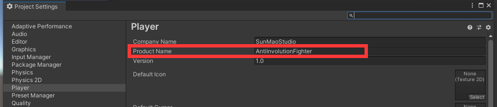
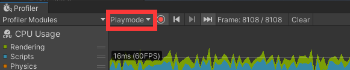
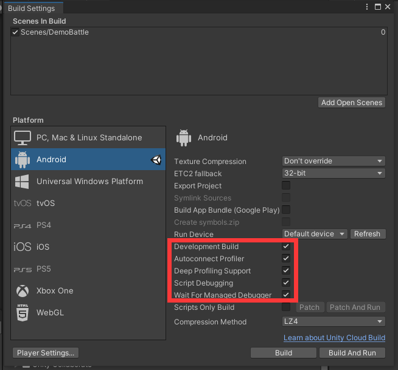

Data Lib 工具类，添加或修改都可以
现在还没开始搞，可以弄自己需要的东西
放源码

切换平台的时候记得在projectSettings的player中的 ==Scripting Define Symbols== 添加 
1. ==UNITASK_DOTWEEN_SUPPORT==
2. ==ODIN_INSPECTOR==
3. ==ODIN_INSPECTOR_3==
4. ==ODIN_INSPECTOR_3_1==

## 1. 安卓调试

手机打开“开发者选项”，打开“USB调试”，打开允许安装

进入目录：..\Unity\Hub\Editor\2020.3.5f1c1\Editor\Data\PlaybackEngines\AndroidPlayer\SDK\platform-tools

cmd 运行 adb 进行调试

```shell
adb forward tcp:34999 localabstract:Unity-[ProductName]
```



打开Window->Analysis->Profiler



在下拉框中选安卓平台

选中下列选项后，直接Build And Run

