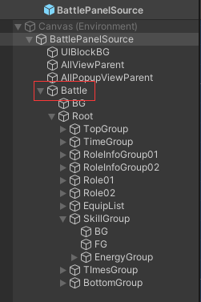

## 1. 安装

1. YIUIFramework工程（必须）
2. Odin（必须）
3. UniTask（必须）
4. DOTween / DOTweenPro（可选）
5. TMP（可选）
6. YooAsset（可选）
7. I2Localization（可选）

## 2. 初始化

1. 在Layer管理中添加“YIUI3DLayer”

2. 进入“Assets/Plugins/YIUIFramework/Helper”，打开UIStaticHelper.cs。配置项目目录结构。

3. 回Editor，点开菜单中的 Tools/YIUI自动化工具 。“全局设置”页签，修改项目设置（修改用户名）。点击初始化项目。

4. 进入“Plugins/YIUIFramework/Panel/Mgr”，打开PanelManager_Root.cs，按需求设置画布大小。同步修改Game窗口分辨率

5. 导入字体适配TMP，projectSettings->Text Mesh Pro->Settings->Default Font Asset（可选）
    YooAsset功能

6. 菜单栏YooAsset->AssetBundle Collector->Settings,选(Show Editor Alias,Enable Addressable,Unique Bundle Name)。Default Package下面的加号，新增Groups。Groups下新增Group命名YIUI。在Collector中添加YIUI这个目录。添加Group，命名RedDot，Collector拖入RedDot目录。

7. 创建主入口main.cs，YIUI自动化工具，点击发布代码。

8. 暂时注释多语言初始化

9. 导入美术资源

10. 右键Resources文件夹创建YooassetSettings

11. 自动化工具创建模块

     

12. 模块结构（图集，预制体，源文件，精灵）

     

13. 拖入模块对应的panel预制体到Prefabs

     

14. 双击Source下的预制体改界面、

     

     

## 3. 开始写bug

1. 双击模块预制体添加一遍

2. 将需要的组件添加到组件表中，回到源文件预制体，点击源数据拆分。之后都在生成的Panel预制体中修改

   

   在这改

   

   Battle是面板资源预制体 ，BattlePanel是生成的组件

3. 写功能用下面的表添加

   

   组件表绑定组件（一般是扩展组件），数据表（选择需要变化的继承Component的组件），事件表（用来自定义参数和修改数据表中的Component）

   被改的数据需要添加对应脚本

## 4. 打包成安卓的操作

1. 代码设置成离线加载模式（目的是让资源生成并加载到StreamingAssets目录中，联机模式和这种模式不同）

   

   地址：[YooAsset教程：初始化 | YooAsset](https://www.yooasset.com/docs/guide-runtime/CodeTutorial1)

   如果是前端调试就使用编辑器模式

2. YooAsset处理

   1. 配置好资源目录

      

   2. 使用Builder工具打包，点击构建

      

3. 打开YIUI自动化工具

   因为移动端反射太消耗性能，使用绑定来替代反射

   

   在UIBindProvider.cs中生成绑定类

   

   